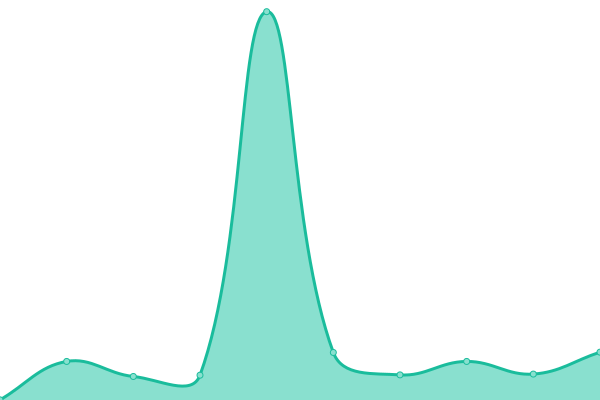

# [📈 Live Status](https://status.katharostech.com): <!--live status--> **🟩 All systems operational**

This repository contains the open-source uptime monitor and status page for [Upptime](https://upptime.js.org), powered by [Upptime](https://github.com/upptime/upptime).

With [Upptime](https://upptime.js.org), you can get your own unlimited and free uptime monitor and status page, powered entirely by a GitHub repository. We use [Issues](https://github.com/upptime/upptime/issues) as incident reports, [Actions](https://github.com/upptime/upptime/actions) as uptime monitors, and [Pages](https://status.katharostech.com) for the status page.

<!--start: status pages-->
<!-- This summary is generated by Upptime (https://github.com/upptime/upptime) -->
<!-- Do not edit this manually, your changes will be overwritten -->

| URL                                          | Status | History                                                                                                              | Response Time                                                                          | Uptime                                                                                                                                                                                                                                        |
| -------------------------------------------- | ------ | -------------------------------------------------------------------------------------------------------------------- | -------------------------------------------------------------------------------------- | --------------------------------------------------------------------------------------------------------------------------------------------------------------------------------------------------------------------------------------------- |
| [KatharosTech.com](https://katharostech.com) | 🟩 Up  | [katharos-tech-com.yml](https://github.com/katharostech/uptime-monitor/commits/master/history/katharos-tech-com.yml) |  300ms |  |

<!--end: status pages-->

[**Visit our status website →**](https://status.katharostech.com)

## 📄 License

- Code: [MIT](./LICENSE) © [Upptime](https://upptime.js.org)
- Data in the `./history` directory: [Open Database License](https://opendatacommons.org/licenses/odbl/1-0/)
